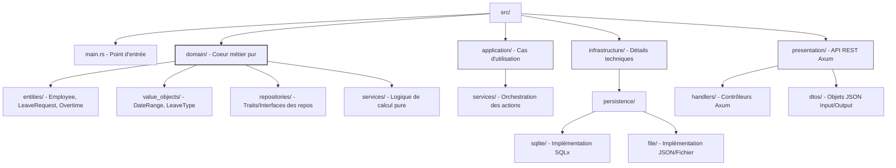
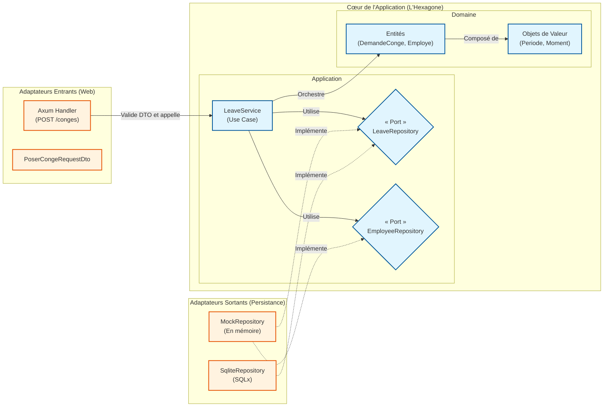
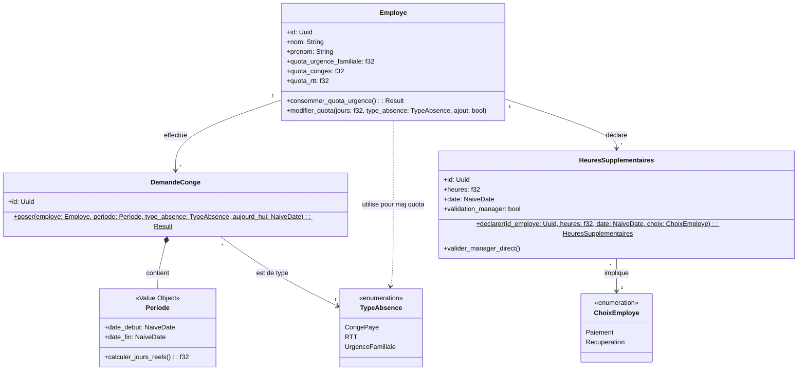
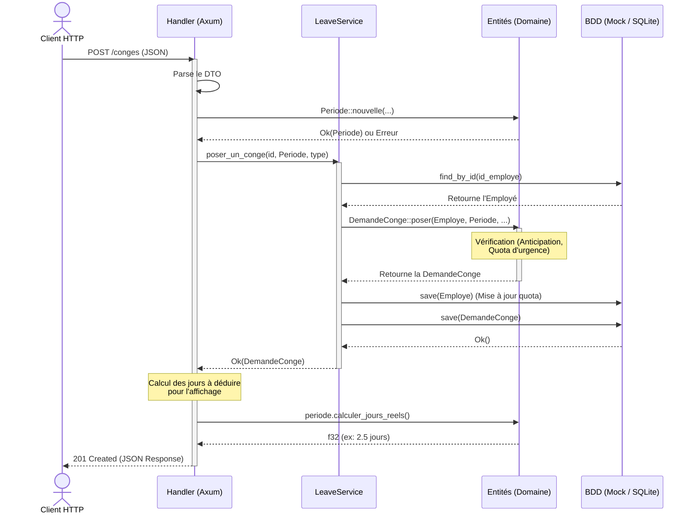

# 🚀 Projet SIRH - Architecture Hexagonale en Rust

Ce projet est une API backend robuste développée en **Rust**, destinée à la gestion des Ressources Humaines (SIRH). Il permet de gérer les employés, leurs quotas de congés, ainsi que la déclaration et la conversion des heures supplémentaires en RTT.

Il a été conçu en respectant les principes de l'**Architecture Hexagonale** (Ports et Adaptateurs), garantissant un code testable, évolutif et indépendant des technologies d'infrastructure.

Dislcaimer : Rust n'a pas à proprement parler de classe : les données et les méthodes sont strictement séparées : Les structs et leur implémentation, ce qui suit exactement les recommandations du DDD.

---

## 🏗️ Architecture du Projet

Le code est organisé en couches. La règle d'or est que les dépendances pointent toujours vers l'intérieur (le domaine métier), qui reste pur et isolé de la technique.

### 1. Le Cœur (Core / Domaine)
C'est le centre de l'application, agnostique du web ou des bases de données.
* **Domain (`core::domain`)** : Contient les entités pures (`Employe`, `HeuresSupplementaires`) et les erreurs métier (`ErreurMetier`).
* **Application (`core::application`)** : Coordonne les cas d'utilisation.
    * **Ports** : Traits Rust définissant les contrats que l'infrastructure doit remplir (`EmployeeRepository`, `HeuresSuppRepository`).
    * **Services** : Orchestrent la logique (`AbsenceService`, `HeuresSuppService`).

### 2. Les Adaptateurs (Adapters / Infrastructure)
Ils font le pont entre le monde extérieur et le métier.
* **Incoming (HTTP)** : API REST avec le framework **Axum**. Réceptionne le JSON, appelle les Services, et renvoie les réponses formatées.
* **Outgoing (Persistance)** : 
    * **SQLite** : Persistance réelle avec **SQLx**. Gère le schéma, les jointures et les `UPSERT`.
    * **Mock** : Base de données en mémoire via des `HashMap` protégées par des `Arc<Mutex<...>>` pour le développement et les tests. Utilisable avec des arguments au run

---

## ✨ Fonctionnalités implémentées

* **Profils Employés** : Consultation des quotas (Congés, RTT, Urgences familiales).
* **Heures Supplémentaires** : 
    * Déclaration (Paiement ou Récupération).
    * Validation par le manager.
    * **Logique Métier** : Conversion automatique des heures validées en jours de RTT (7h = 1j) ajoutés au solde de l'employé.

---

## 🛠️ Installation et Lancement

### 1. Préparation
L'application crée automatiquement une base SQLite `mon_sirh.db` au premier lancement avec un employé de test (**Jean Dupont**).

### 2. Lancement (Mode SQLite par défaut)
```bash
cargo run
```

### 3. Lancement (Mode Mock)
```bash
# Windows (PowerShell)
$env:USE_MOCK="true"; cargo run

# Linux / MacOS
USE_MOCK=true cargo run
```

---

## 🧪 Exemples de Test (API)

### Fichiers de test recommandés
Créer ces fichiers à la racine de ton projet pour simplifier les appels `curl`.

**test_hs.json**
```json
{
    "id_employe": "f098ab96-3799-4481-b0d5-d0c3bfe509b0",
    "heures": 7.0,
    "date": "2026-04-17",
    "choix": "Recuperation"
}
```

**test_conge.json**
```json
{
  "id_employe": "f098ab96-3799-4481-b0d5-d0c3bfe509b0",
  "date_debut": "2026-05-1",
  "moment_debut": "Matin",
  "date_fin": "2026-05-8",
  "moment_fin": "Soir",
  "type_absence": "CongePaye"
}
```

### Commandes de test (Scénario complet)

1. **Vérifier l'état de l'employé :**
   ```bash
   curl -X GET http://127.0.0.1:3000/employes/f098ab96-3799-4481-b0d5-d0c3bfe509b0
   ```

2. **Déclarer des Heures Supplémentaires :**
   ```bash
   curl -X POST http://127.0.0.1:3000/heures-supp -H "Content-Type: application/json" -d @test_hs.json
   ```
   *(Note : Copie l'ID `"id":"..."` reçu dans la réponse).*

3. **Valider les Heures (Manager) :**
   ```bash
   # Remplace <ID_HS> par l'ID reçu à l'étape précédente
   curl -X POST http://127.0.0.1:3000/heures-supp/<ID_HS>/valider
   ```

4. **Vérifier le gain de RTT :**
   ```bash
   curl -X GET http://127.0.0.1:3000/employes/f098ab96-3799-4481-b0d5-d0c3bfe509b0
   ```
   *(Le champ `quota_rtt` doit être passé de 0.0 à 1.0).*

5. **Lister toutes les déclarations de l'employé :**
   ```bash
   curl -X GET http://127.0.0.1:3000/employes/f098ab96-3799-4481-b0d5-d0c3bfe509b0/heures-supp
   ```


   ## 1. Architecture Clean Code
Visualisation de la structure des dossiers et de la séparation des responsabilités.



## 2. Architecture Hexagonale (Ports & Adaptateurs)
Représentation des flux entre les adaptateurs et le cœur de l'application.



## 3. Diagramme de Classes
Détail des entités et des objets de valeur.



## 4. Diagramme de Séquence (Poser un congé)
Flux d'exécution complet lors d'une requête HTTP.



***